# Doctor Tracker

## Description

Doctor Tracker is a secure administrative web application for hospital staff to manage doctors and their patients from a single dashboard. An authenticated admin can register doctors with their specialization and hospital, search and filter the doctor directory, drill into a doctor's own patient roster, and add, edit, or remove patients — all backed by paginated, indexed MongoDB queries so the UI stays fast as the dataset grows. A dedicated analytics dashboard aggregates the same data into headline stats and charts (doctors per specialization, patients per doctor, condition breakdowns, and 30-day registration trends), giving an admin a quick read on the state of the practice without leaving the app.

## Features

**Authentication**
- Email/password login; session held in a JWT stored as an httpOnly cookie
- Every `/dashboard`, `/doctors`, and `/patients` route is gated server-side — unauthenticated visitors are redirected to `/login` before the page ever renders
- Login endpoint is rate-limited against brute-force attempts

**Doctors**
- Create a doctor (name, specialization, hospital, phone, email)
- List with search, specialization filter, date-range filter, sorting, and pagination
- Edit and delete a doctor (deleting cascades to that doctor's patients)
- Per-doctor patient roster, with add/remove directly from the doctor's page

**Patients**
- Dedicated patients page listing every patient across all doctors
- Search, filter by condition and date range, sorting, and pagination
- Edit and delete patient records

**Dashboard**
- Total doctors, total patients, average patients per doctor, specializations covered
- Charts: patients per doctor, doctors by specialization, patients by condition, 30-day registration trend
- Every number comes from a MongoDB aggregation pipeline — nothing is fetched in bulk and reduced in the browser

**UI**
- Responsive across mobile, tablet, and desktop, with a collapsible sidebar
- Light/dark theme, persisted across sessions
- Toasts, loading/empty states, and confirm-before-delete dialogs throughout

## Tech Stack

| Layer | Choice |
|---|---|
| Frontend | Next.js 16 (App Router, TypeScript), Tailwind CSS v4, TanStack Query, React Hook Form + Zod, Recharts |
| Backend | Node.js, Express (TypeScript), Mongoose |
| Database | MongoDB (indexed collections, aggregation pipelines) |
| Auth | JWT in an httpOnly cookie, verified independently by the Express API and the Next.js Proxy |

The frontend and backend are two independent applications (`frontend/` and `backend/`) that talk to each other exclusively over a REST API — there is no shared code or process between them.

## System Architecture

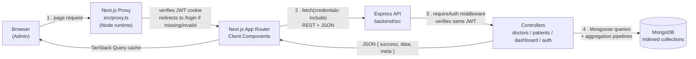

1. Every navigation first hits `frontend/src/proxy.ts`, which reads the `dt_token` cookie and verifies it with the shared `JWT_SECRET` — unauthenticated requests to any page other than `/login` are redirected before a single component renders.
2. Pages are client components that call the Express API directly via a small `fetch` wrapper (`lib/api.ts`) with `credentials: "include"`, so the same httpOnly cookie rides along automatically. TanStack Query caches responses, dedupes in-flight requests, and invalidates the right keys after a mutation (e.g. deleting a doctor invalidates doctors, patients, and dashboard queries at once).
3. The Express API re-verifies the JWT on every protected route independently of the proxy (`requireAuth` middleware) — the frontend's check is a UX convenience, not the security boundary.
4. Controllers translate query params (`search`, `specialization`/`condition`, `dateFrom`/`dateTo`, `page`, `limit`, `sort`) into MongoDB filters that run against indexed fields, and the dashboard endpoint runs a handful of `$group`/`$lookup` aggregation pipelines in parallel rather than pulling full collections into Node.

## Setup Guide

### Prerequisites

- Node.js 20+
- npm
- MongoDB — **optional for local development.** If `MONGODB_URI` is left empty, the backend automatically starts a real, locally-managed MongoDB instance via `mongodb-memory-server` (data persists in `backend/.data/mongodb` between restarts). Set a real `MONGODB_URI` (local `mongod` or [MongoDB Atlas](https://www.mongodb.com/atlas)) for production use.

### 1. Backend

```bash
cd backend
npm install
cp .env.example .env      # defaults work out of the box for local dev
npm run dev                # starts on http://localhost:4000
```

On first boot the server automatically creates the admin account from `.env` (default `admin@doctortracker.com` / `ChangeMe123!`) and, outside of production, seeds a handful of sample doctors and patients so the dashboard isn't empty. To (re)seed manually — e.g. against a real MongoDB/Atlas database — run `npm run seed`.

`backend/.env.example`:

```env
PORT=4000
NODE_ENV=development
MONGODB_URI=
JWT_SECRET=replace-with-a-long-random-secret
JWT_EXPIRES_IN=7d
ADMIN_EMAIL=admin@doctortracker.com
ADMIN_PASSWORD=ChangeMe123!
CLIENT_ORIGIN=http://localhost:3000
```

### 2. Frontend

```bash
cd frontend
npm install
cp .env.example .env.local   # JWT_SECRET must match the backend's exactly
npm run dev                   # starts on http://localhost:3000
```

`frontend/.env.example`:

```env
NEXT_PUBLIC_API_URL=http://localhost:4000/api
JWT_SECRET=replace-with-a-long-random-secret
```

### 3. Log in

Open `http://localhost:3000`, sign in with the seeded admin credentials above, and you'll land on the dashboard with sample data already in place.

## Project Structure

```
doctor-tracker/
  backend/            Standalone Express + MongoDB REST API
    src/
      config/         env loading, MongoDB connection (incl. dev fallback)
      models/         Admin, Doctor, Patient (Mongoose schemas + indexes)
      controllers/     request handlers (auth, doctors, patients, dashboard)
      routes/          Express routers, mounted under /api
      middleware/      requireAuth (JWT cookie check), centralized error handler
      validators/      Zod request-validation schemas
      seed/            idempotent admin + sample-data seeding
  frontend/            Next.js 16 App Router client
    src/
      app/             routes: /login, /(app)/dashboard, /doctors, /patients
      components/      ui primitives, doctors/patients/dashboard components
      hooks/           TanStack Query hooks per resource
      lib/             fetch wrapper, className helper
      proxy.ts         route-protection (Next.js 16's middleware replacement)
  docs/screenshots/    UI screenshots referenced below
```

## Technical Decisions

### 1. Two standalone applications instead of one full-stack Next.js app

Next.js can host both the UI and the API in one project via Route Handlers, and for a small CRUD app that's often the simpler path. I split this into `frontend/` (Next.js, UI only) and `backend/` (Express, API only) instead, talking exclusively over REST, for a few reasons:

- **The API is independently testable this way.** I could exercise every endpoint with `curl` — auth, validation, pagination, the aggregation queries — without any of it being entangled with React rendering, which made it much faster to catch bugs while building.
- **The auth model has to hold up across two runtimes either way.** A JWT in an httpOnly cookie, verified independently by Express and by the Next.js proxy, is the same shape whether the API is co-located with the frontend or not — so keeping them separate didn't cost anything on the security side.
- **Independent deploys.** The API can be redeployed, restarted, or moved to a different host without rebuilding the frontend, and vice versa — closer to how a real backend would sit behind its own infrastructure in production.

The cost is real: two `npm install`s, two `.env` files, and CORS/cookie configuration a same-origin app wouldn't need. For a project this size that's a small, one-time cost in exchange for a backend that's genuinely testable on its own.

### 2. Pushing search, filtering, pagination, and analytics into MongoDB instead of the app layer

Every list endpoint (`/doctors`, `/patients`, `/doctors/:id/patients`) accepts `search`, `specialization`/`condition`, `dateFrom`/`dateTo`, `page`, `limit`, and `sort`, and turns them directly into a Mongoose filter + `.sort().skip().limit()` chain executed by MongoDB — the API never loads a full collection into Node to filter or slice it in JavaScript. This is backed by indexes chosen to match the actual filters in use: a text index on `name`/`specialization`/`hospital` (doctors) and `name`/`condition` (patients) for the search box, a single-field index on `specialization`/`condition` for the dropdown filters, an index on `doctor` for the "patients under this doctor" lookups, and a descending index on `createdAt` for both the default sort and the date-range filter.

The dashboard's `/dashboard/stats` endpoint follows the same principle: total counts, patients-per-doctor, specialization/condition breakdowns, and the 30-day registration trend are each a single aggregation pipeline (`$match`/`$group`/`$lookup`) run in parallel via `Promise.all`, rather than fetching doctors and patients client-side and reducing them in the browser. The tradeoff is that the query logic lives in the controller instead of being reusable client-side — acceptable here since the frontend has exactly one consumer (this app) and the aggregation shape is dashboard-specific enough that a generic client-side reducer wouldn't have been simpler anyway.

## Performance & Best Practices

- **Indexed queries end-to-end** — every filter exposed in the UI (search, specialization, condition, date range) has a matching MongoDB index; see `backend/src/models/*.ts`.
- **Server-side pagination** — list endpoints return `{ data, meta: { page, limit, total, totalPages } }`; the UI never paginates a fully-loaded array client-side.
- **Debounced search** (350ms) on both the Doctors and Patients pages to avoid firing a request per keystroke.
- **TanStack Query caching** — `staleTime` avoids redundant refetches on tab focus; mutations invalidate only the query keys they affect, so unrelated views don't re-render.
- **Route protection at the edge** — `proxy.ts` verifies the JWT before a protected page is ever rendered, in addition to the API's own `requireAuth` check.
- **Validated inputs on both ends** — Zod schemas validate the API payloads server-side, and React Hook Form + the same-shaped Zod schemas validate the UI forms before a request is even sent.
- **Rate-limited login** — `POST /api/auth/login` is throttled (10 attempts / 15 min) to slow down credential-stuffing attempts.
- **Light/dark theme** — respects the OS preference by default and is toggleable from the sidebar; persisted via `next-themes`, with the theme-dependent icon read through `useSyncExternalStore` off the actual DOM class rather than the React context value, avoiding a hydration mismatch between the server render and the client's first paint.
- **Collapsible sidebar** — the desktop sidebar collapses to an icon-only rail (persisted in `localStorage`) to reclaim horizontal space on narrower screens; tables use `whitespace-nowrap` cells inside a horizontally-scrolling container so columns never wrap awkwardly.

## Visual Evidence

### Desktop

| Login | Dashboard |
|---|---|
| 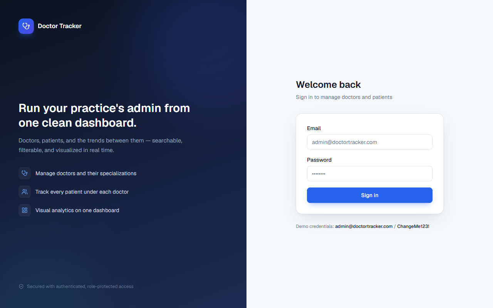 | 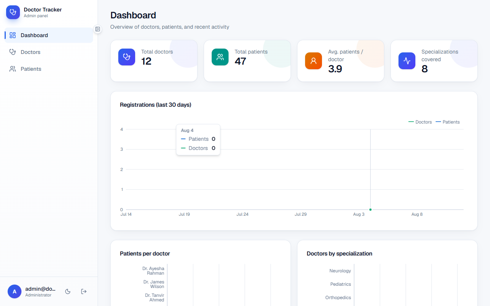 |

| Doctors | Doctor detail |
|---|---|
| 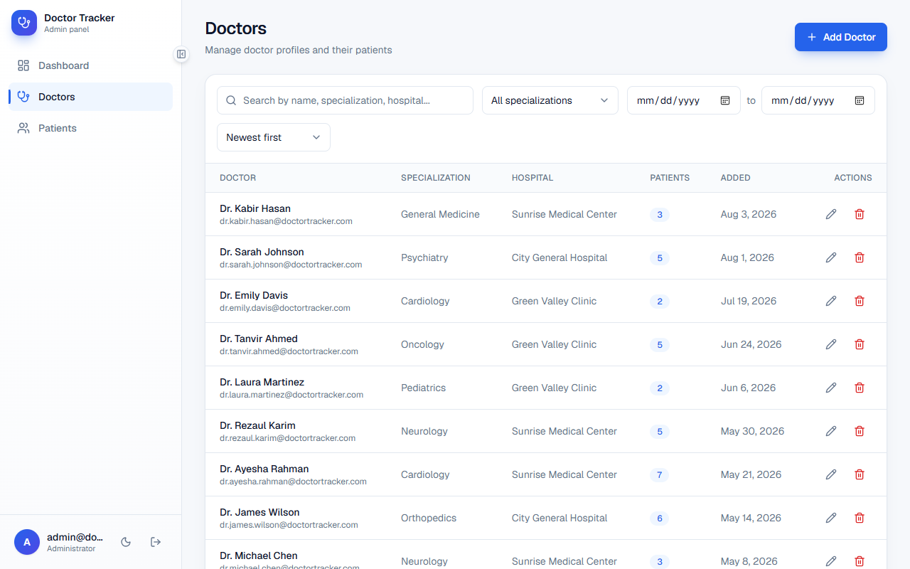 | 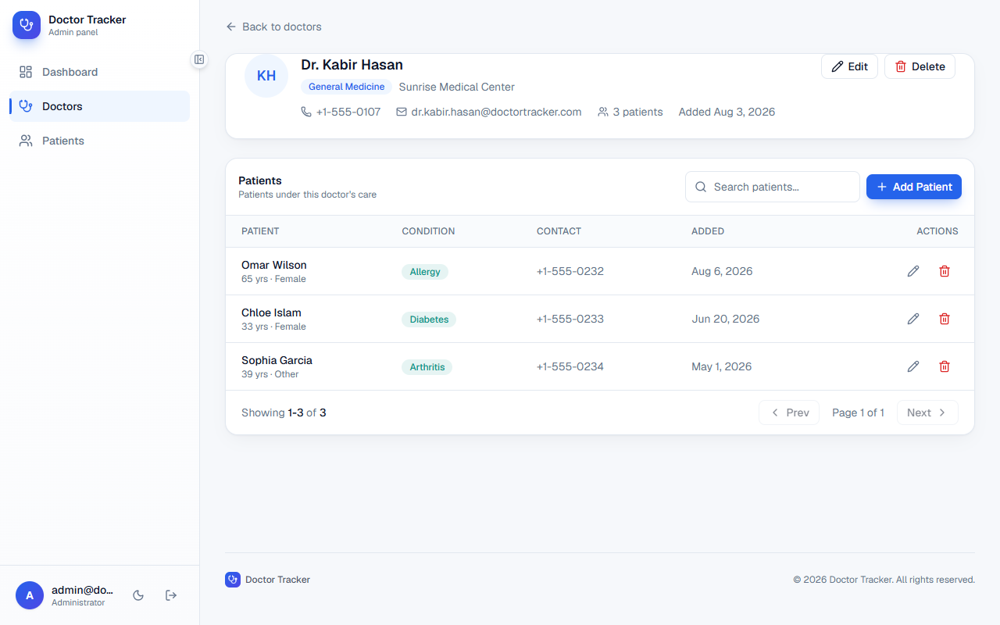 |

| Patients |
|---|
| 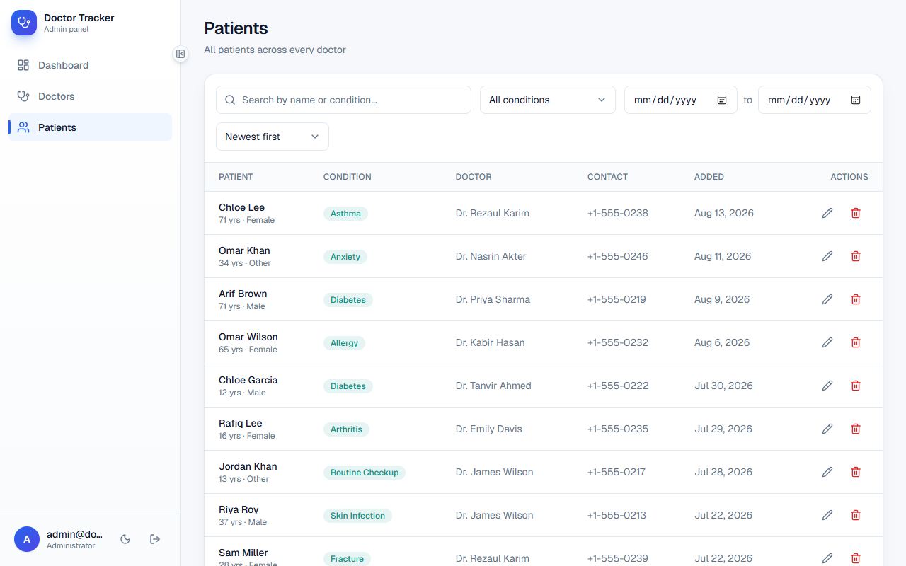 |

### Dark mode

| Dashboard | Doctors |
|---|---|
| 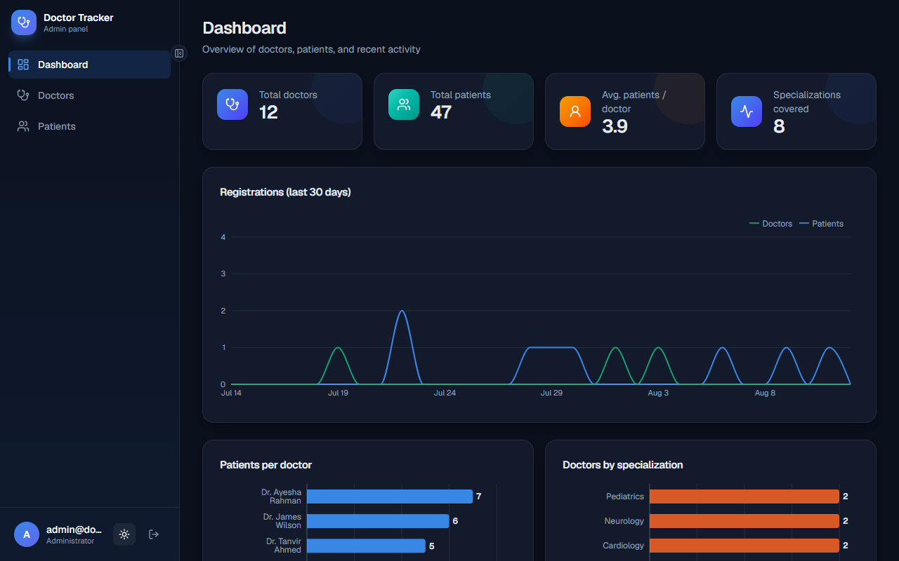 | 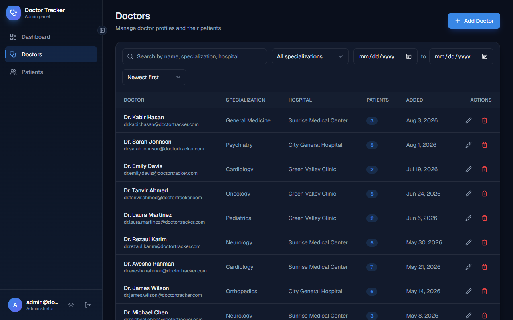 |

### Mobile (390px)

| Dashboard | Doctors | Navigation |
|---|---|---|
| 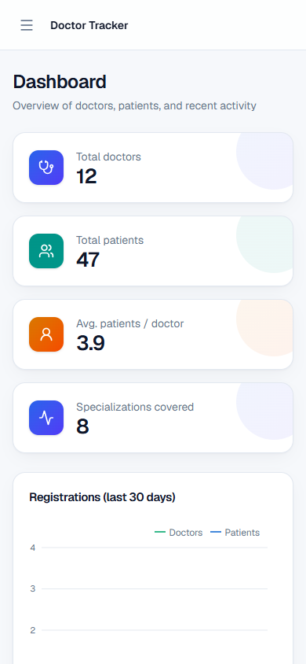 | 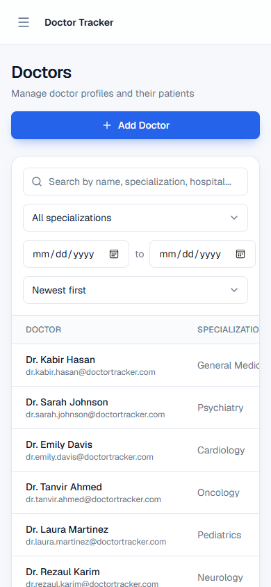 | 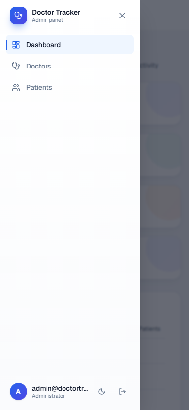 |

## Scripts

| Location | Command | Purpose |
|---|---|---|
| `backend` | `npm run dev` | Start the API with hot reload |
| `backend` | `npm run build` / `npm start` | Production build / run |
| `backend` | `npm run seed` | Idempotently seed the admin account + sample data |
| `backend` | `npm run typecheck` | `tsc --noEmit` |
| `frontend` | `npm run dev` | Start the Next.js dev server |
| `frontend` | `npm run build` / `npm start` | Production build / run |
| `frontend` | `npm run lint` | ESLint |
